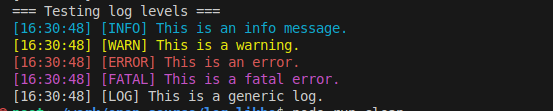

# log-likho
A console.log, that logs on console as well as on a file in `logs/` folder.
Plus an advance logger with `INFO`, `WARN`, `ERROR` & `FATAL` modes.

### Simple Logger Usage

```sh
npm install log-likho
```

Replace the normal console.log with this "file + console" log function.

```js
console.log = require('log-likho')();

console.log('testing 1');
```

This should do normal log to console but also write logs real-time to the `logs/` folder

##### Log in append mode

```js
console.log = require('log-likho')({mode: 'a'});

console.log('testing 1');
```


##### With all the options

```js
const simple_logger = require('log-likho');

console.log = simple_logger({
  logs_folder: './my_folder',
  mode: "a",
})

```

This will create log files in `my_folder` and will not overwrite it with new logs on next executions.


## Advance logger

🚀 Features

    ✅ Supports info, warn, error, fatal, and log levels

    ✅ Colored terminal output for easy debugging

    ✅ Custom log folder and file mode (append/overwrite)

    ✅ No external dependencies

### Usage

```sh
npm install log-likho
```

To use the logger. 

```js
const { create_logger } = require("log-likho");

const logger = create_logger({
  logs_folder: "./logs", // default: './logs'
  mode: "a"              // append mode; use 'w' for overwrite
});

logger.info("This is an info message");
logger.warn("This is a warning");
logger.error("This is an error");
logger.fatal("This is a fatal error");
logger.log("This is a plain log message");
```

##### Output



| Level | Terminal Color     |
| ----- | ------------------ |
| INFO  | Cyan               |
| WARN  | Yellow             |
| ERROR | Red                |
| FATAL | Magenta            |
| LOG   | Default (no color) |


## Default options

| Option        | Type   | Default  | Description                                            |
| ------------- | ------ | -------- | ------------------------------------------------------ |
| `logs_folder` | String | `./logs` | Directory to store log files                           |
| `mode`        | String | `"a"`    | File write mode: `"a"` for append, `"w"` for overwrite |


## Typescript Compatible

`log-likho` now supports TypeScript out of the box.

- Includes `index.d.ts` for type safety.
- Works seamlessly with both JavaScript and TypeScript projects.
- No extra setup needed — just import and use!

```ts
import log, {create_logger} from 'log-likho';

const logger = create_logger();

logger.info("This is an info message");
logger.warn("This is a warning");
logger.error("This is an error");
logger.fatal("This is a fatal error");
logger.log("This is a plain log message");
```
